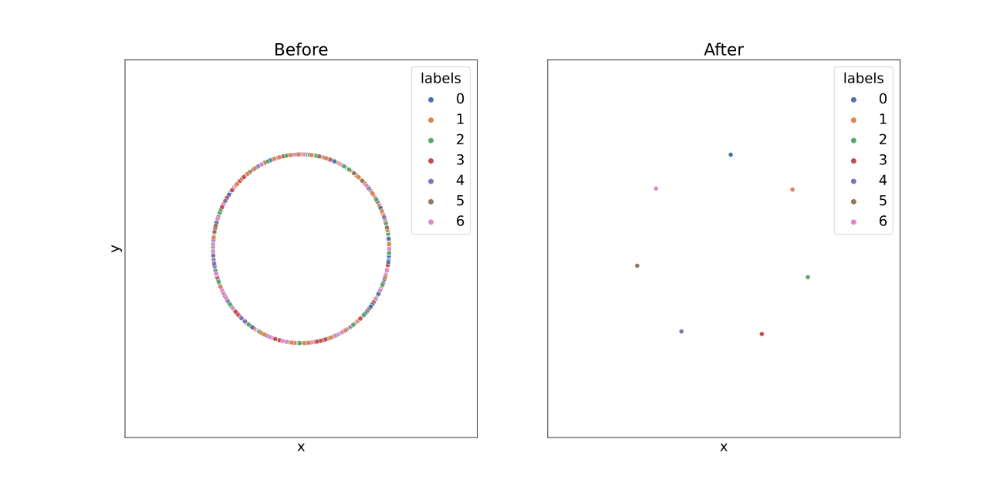
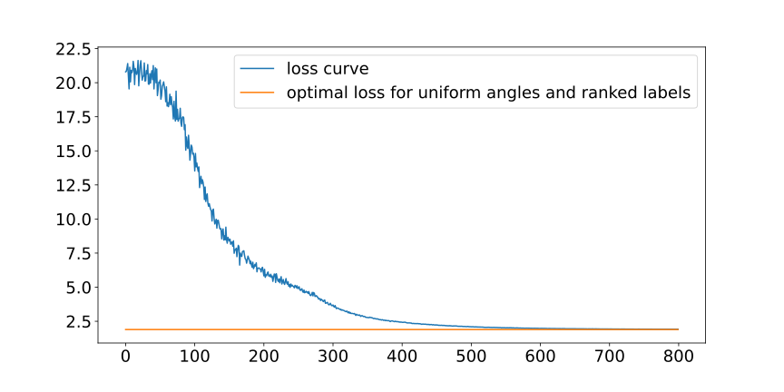

# LabelAwareRanked-Loss

In this repository, we implement different kinds of losses which are mainly Triplet loss, Multiclass-N-pair loss, Constellation loss, and LabelAwareRanked loss. We use the same smart batch structure to test. Batch is selected by using `BalancedBatchSampler`

## Code execution

The experiment on a randomly generated dataset shows that the LAR loss creates ranked embeddings in uniform angles when it is close to the optimal solution. This experiment can be executed by the following command:

- "num_classes" ---- number of classes of the dataset (int)
- "num data" ---- number of datapoints  (int)
- "num_iter" ---- number of iterations (int)
- "plot" --- "True" or "False" if u want to create the plots

<pre><code>python gradient_descent_rnd_data.py --num_classes 7 --num_data 1000 --num_iter 1000 --plot True
</code></pre>
For MNIST the experiment can be executed by the following script. There are two parameters you can choose.

1. Loss: 
   - "triplet" ---- Triplet loss
   - "npair" --- Multiclass-N-pair loss
   - "constellation" --- Constellation loss
   - "lar" --- LabelAwareRanked loss
2. Number of epochs: choose a integer

Run the code in command line like following:

<pre><code>python main.py --loss lar --num_epochs 10
</code></pre>

